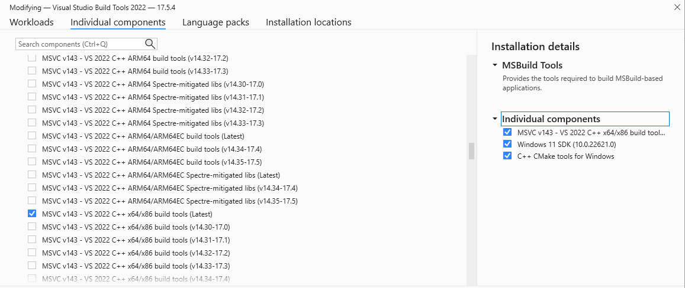

## espeak

We use [phonemizer](https://github.com/bootphon/phonemizer) to analyze English phonemes, and espeak is used inside phonemizer.  
This follows the analysis method of [VITS original](https://github.com/jaywalnut310/vits).

Without espeak, the following error should occur when generating English speech.  
`RuntimeError: espeak not installed on your system`.

### Installing espeak
Download `espeak-ng-X64.msi` from [here](https://github.com/espeak-ng/espeak-ng/releases) and run it.  
After execution, add `PHONEMIZER_ESPEAK_LIBRARY` to the system environment variable and set the value to the following and you are done. 
`C:\Program Files\eSpeak NG\libespeak-ng.dll`

Note that environment variables are not reflected in the terminal (PowersShell, VSCode, etc.) until the terminal is restarted.

## Build Tools for Visual Studio
We use pyopenjtalk for Japanese phoneme and accent analysis.  
To install pyopenjtalk on Windows, three tools provided by Microsoft are required.

### Installation
Download `Build Tools for Visual Studio 2022` from [here](https://visualstudio.microsoft.com/ja/downloads/#build-tools-for-visual-studio-2022) & Run and install the following tools.

`C++ Cmake tools for Windows`.  
`MSVC v143 -VS 2022 C++ x64/x86 build tools (Latest)`  
`Windows 11 SDK`

After installation, set the system environment variables and you are done.  
Edit `Path` in the system environment variable and add the following  

`C:\Program Files (x86)\Microsoft Visual Studio\2022\BuildTools\Common7\IDE\CommonExtensions\Microsoft\CMake\CMake\bin`.

Note that environment variables will not be reflected in PowersShell or VSCode until PowersShell or VSCode is restarted.

---
Reference
- pyopenjtalk  
https://github.com/log1stics/voice-generator-webui/issues/1  
https://discourse.slicer.org/t/configuring-slicer-fails-c-compiler-not-found/23340/3

- espeak  
https://bootphon.github.io/phonemizer/install.html#on-windows  
https://github.com/bootphon/phonemizer/issues/44